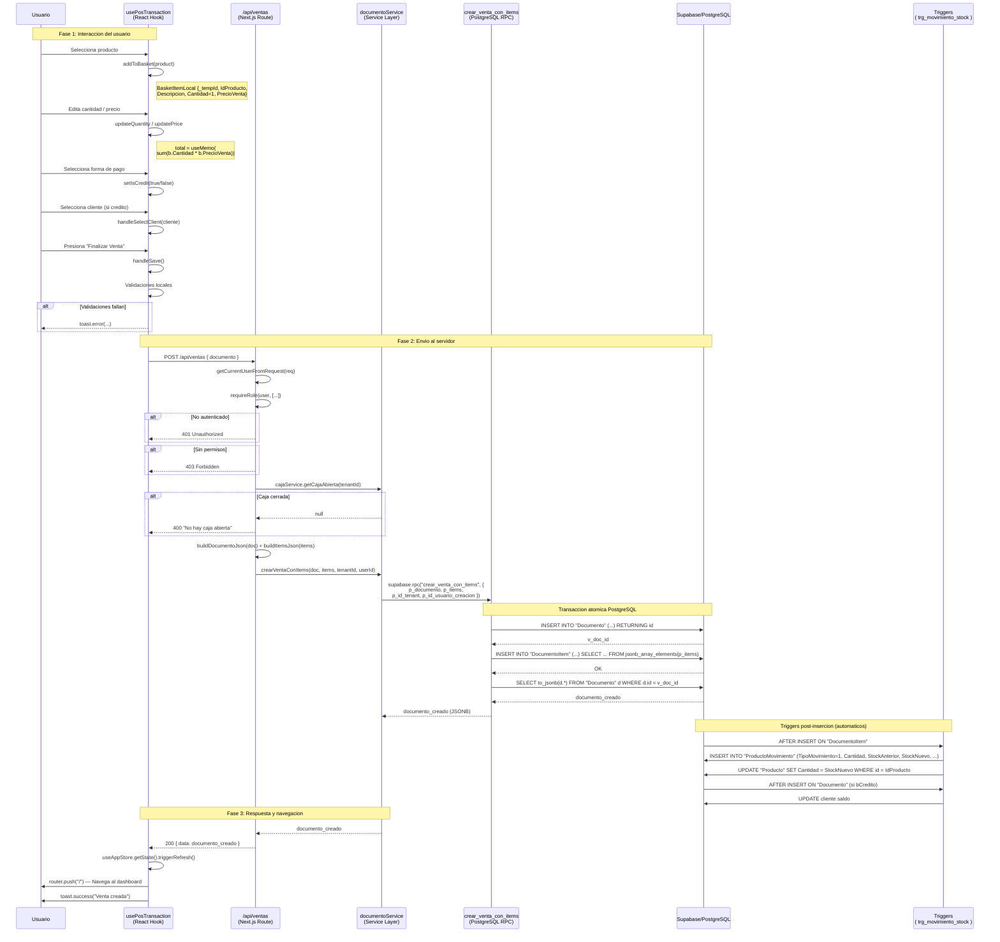
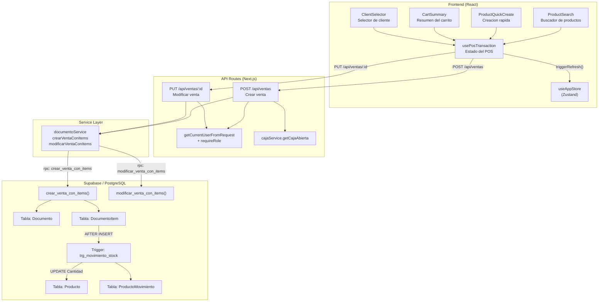
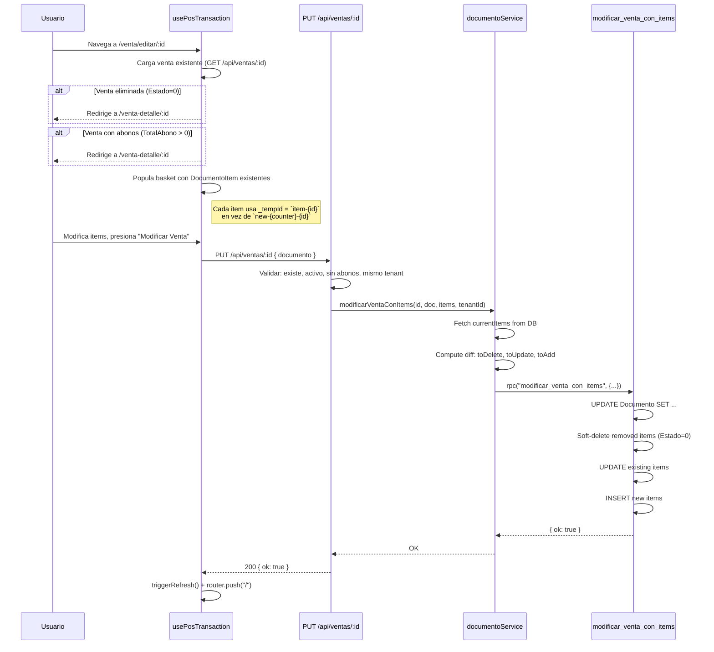

# Flujo de Creacion de Ventas — Documentacion Tecnica

## 1. Estructura del Objeto Venta

### 1.1 Tipo TypeScript: `Documento` (encabezado)

```typescript
// src/types/database.ts
interface Documento {
  id: number;                     // Auto-generado por BD (0 en creación)
  Estado: number;                 // 1 = activo, 0 = eliminado (siempre 1 al crear)
  IdTenant: number;               // Inyectado por API route (0 en frontend)
  FechaCreacion: string;          // Auto-generado por BD/RPC (NOW())
  FechaEmision: string;           // OBLIGATORIO — fecha seleccionada por el usuario
  Descripcion: string | null;     // No usado en ventas (null)
  Concepto: string | null;        // No usado en ventas (null)
  Total: number;                  // CALCULADO — sum(Cantidad * PrecioVenta)
  bCredito: boolean;              // OBLIGATORIO — false=contado, true=credito
  IdCliente: number | null;       // OBLIGATORIO si bCredito=true
  IdClienteDireccion: number | null;
  DireccionEntrega: string | null;
  DocumentoItem?: DocumentoItem[]; // Array de lineas de detalle
  Cliente?: Cliente;              // Solo lectura (join)
  TotalAbono: number;             // Siempre 0 al crear
  IdTipoDocumento: number;        // 1 = Venta (fijo)
  Saldo: number;                  // CALCULADO — bCredito ? Total : 0
  IdMetodoPago: number | null;
}
```

### 1.2 Tipo TypeScript: `DocumentoItem` (lineas de detalle)

```typescript
// src/types/database.ts
interface DocumentoItem {
  id: number;                     // Auto-generado por BD (0 en creación)
  IdProducto: number;             // OBLIGATORIO
  Descripcion: string;            // OBLIGATORIO — nombre del producto al momento
  Cantidad: number;               // OBLIGATORIO — minimo 1
  PrecioVenta: number;            // OBLIGATORIO — precio unitario al momento
  MontoAbono: number;             // Siempre 0 en ventas (usado en pagos/abonos)
  Total: number;                  // CALCULADO — Cantidad * PrecioVenta
  IdDocumento: number;            // Asignado por BD (FK al Documento padre)
  IdDocumentoRef: number | null;  // Solo usado en devoluciones/abonos
}
```

### 1.3 Tipo frontend: `BasketItemLocal` (estado local del carrito)

```typescript
// src/hooks/use-pos-transaction.ts
interface BasketItemLocal {
  _tempId: string;      // ID temporal: "new-{counter}-{productId}"
  IdProducto: number;   // FK al producto
  Descripcion: string;  // Nombre del producto (copiado al agregar)
  Cantidad: number;     // Cantidad (minimo 1)
  PrecioVenta: number;  // Precio unitario (editable en el POS)
  MontoAbono: number;   // Siempre 0 en ventas
}
```

### 1.4 Resumen de campos

| Campo                | Origen           | Obligatorio | Notas                                     |
|----------------------|------------------|-------------|-------------------------------------------|
| `id`                 | Auto (BD)        | No          | Se ignora en creación (0)                |
| `Estado`             | Fijado (1)       | No          | Siempre 1 al crear                        |
| `IdTenant`           | Inyectado (API)  | No          | Del JWT del usuario autenticado           |
| `FechaCreacion`      | Auto (RPC)       | No          | `NOW()` en PostgreSQL                     |
| `FechaEmision`       | Usuario          | **Si**      | Date picker en el POS                     |
| `Total`              | Calculado (FE)   | **Si**      | `sum(item.Cantidad * item.PrecioVenta)`   |
| `bCredito`           | Usuario          | **Si**      | Toggle en el POS                          |
| `IdCliente`          | Condicional      | **Si** si bCredito | Validado en FE y API               |
| `IdClienteDireccion` | Usuario          | No          | Dirección de entrega                      |
| `Saldo`              | Calculado        | No          | `bCredito ? Total : 0`                   |
| `IdTipoDocumento`    | Fijado (1)       | No          | 1 = Venta                                 |
| `TotalAbono`         | Fijado (0)       | No          | Se usa en pagos, no en ventas             |

---

## 2. Secuencia de Generacion (Paso a Paso)

### 2.1 Frontend: Interaccion del usuario

```
[1] Usuario navega a /venta/nueva
    → usePosTransaction() se inicializa
    → Carga paralela: GET /api/caja (validar caja abierta) + GET /api/productos (catálogo)

[2] Usuario busca y selecciona un producto
    → addToBasket(product) agrega BasketItemLocal con _tempId generado
    → Si el producto ya existe en el carrito: incrementa Cantidad +1
    → Si es nuevo: agrega con Cantidad=1, PrecioVenta=product.PrecioVenta

[3] Usuario edita cantidades, precios, forma de pago, fecha, cliente
    → updateQuantity / setQuantity / updatePrice actualizan el estado local
    → total se recalcula via useMemo: sum(b.Cantidad * b.PrecioVenta)

[4] Usuario presiona "Finalizar Venta"
    → handleSave() ejecuta validaciones:
      - basket.length === 0 → error
      - isCredit && !selectedClientId → error
      - canSave = cajaAbierta === true && basket.length > 0
```

### 2.2 Frontend: Construccion del payload

```typescript
// usePosTransaction.ts — handleSave()
const documento: Documento = {
  id: 0,                              // Ignorado en creación
  Estado: 1,                          // Siempre activo
  IdTenant: 0,                        // Ignorado — inyectado por API
  FechaCreacion: new Date().toISOString(), // Ignorado — NOW() en RPC
  FechaEmision: fecha,                // Del date picker
  Descripcion: null,                  // No usado en ventas
  Concepto: null,                     // No usado en ventas
  Total: total,                       // Calculado en frontend
  bCredito: isCredit,                 // Toggle del usuario
  IdCliente: selectedClientId,        // Del selector de cliente
  IdClienteDireccion: selectedDireccionId,
  DireccionEntrega: null,
  DocumentoItem: basket.map(b => ({
    id: 0,                             // Ignorado en creación
    IdProducto: b.IdProducto,
    Descripcion: b.Descripcion,
    Cantidad: b.Cantidad,
    PrecioVenta: b.PrecioVenta,
    MontoAbono: b.MontoAbono,          // Siempre 0
    Total: b.Cantidad * b.PrecioVenta, // Calculado
    IdDocumento: 0,                    // Asignado por BD
    IdDocumentoRef: null,
  })),
  Cliente: undefined,                 // Solo lectura
  TotalAbono: 0,                      // Siempre 0
  IdTipoDocumento: 1,                 // 1 = Venta
  Saldo: isCredit ? total : 0,        // Calculado
  IdMetodoPago: null,
};

// Si es edición: documento.id = id (el ID de la venta existente)
```

### 2.3 API Route: Validacion y procesamiento

```
POST /api/ventas
│
├── [1] Autenticación
│   └── getCurrentUserFromRequest(req) → JWT → APIUser { id, codigo, rol, idTenant }
│   └── Si null → 401
│
├── [2] Autorización
│   └── requireRole(user, ["ADMIN", "CAJERO", "VENDEDOR", "SUPERVISOR"])
│   └── Si no tiene rol → 403
│
├── [3] Validación de caja
│   └── cajaService.getCajaAbierta(user.idTenant)
│   └── Si null → 400 "No hay caja abierta"
│
├── [4] Extracción y limpieza del body
│   └── Destructuring del body JSON
│   └── IdCliente: null si 0 o vacío
│   └── Validación: FechaEmision y Total obligatorios
│
├── [5] Delegación al service layer
│   └── documentoService.crearVentaConItems(doc, items, user.idTenant, user.id)
│
└── [6] Respuesta
    └── 200 { data: createdDoc } o 500 { error: "..." }
```

### 2.4 Service Layer: Construccion del payload RPC

```typescript
// documento-service.ts — crearVentaConItems()
const docJson = buildDocumentoJson(doc);
// Resultado:
{
  FechaEmision: "2026-05-11",
  Descripcion: null,
  Concepto: null,
  Total: 1500,
  bCredito: false,
  IdCliente: null,           // NULLIF convierte 0 → null
  IdClienteDireccion: null,
  DireccionEntrega: null,
  IdTipoDocumento: 1,        // Default a 1 si no viene
  Saldo: 0,                  // bCredito ? Total : 0
  IdMetodoPago: null,
}

const itemsJson = buildItemsJson(items);
// Resultado:
[
  { IdProducto: 5, Descripcion: "Coca Cola", Cantidad: 2, PrecioVenta: 500,
    MontoAbono: 0, Total: 1000, IdDocumentoRef: null },
  { IdProducto: 3, Descripcion: "Pan", Cantidad: 1, PrecioVenta: 500,
    MontoAbono: 0, Total: 500, IdDocumentoRef: null }
]
```

### 2.5 Base de Datos: RPC `crear_venta_con_items`

```sql
-- Ejecutado en una sola transacción PostgreSQL
BEGIN;

-- 1. INSERT en Documento
INSERT INTO "Documento" (
  "FechaEmision", "Descripcion", "Concepto", "Total", "bCredito",
  "IdCliente", "IdClienteDireccion", "DireccionEntrega", "TotalAbono",
  "IdTipoDocumento", "Saldo", "IdMetodoPago", "IdTenant", "Estado",
  "IdUsuarioCreacion", "FechaCreacion"
) VALUES (...)
RETURNING id INTO v_doc_id;

-- 2. INSERT en DocumentoItem (por cada item del array JSONB)
INSERT INTO "DocumentoItem" (
  "IdProducto", "Descripcion", "Cantidad", "PrecioVenta",
  "MontoAbono", "Total", "IdDocumento", "IdDocumentoRef",
  "IdTenant", "Estado"
) SELECT ... FROM jsonb_array_elements(p_items);

-- 3. Retorna el documento creado como JSONB
SELECT to_jsonb(d.*) FROM "Documento" d WHERE d.id = v_doc_id;

COMMIT;
```

### 2.6 Triggers PostgreSQL (post-insercion)

Los siguientes triggers se ejecutan automaticamente despues de la insercion:

| Trigger                 | Tabla            | Accion                                                        |
|-------------------------|------------------|---------------------------------------------------------------|
| `trg_movimiento_stock`  | DocumentoItem    | INSERT en `ProductoMovimiento` con TipoMovimiento correspondiente y UPDATE `Producto.Cantidad` |
| `trg_actualizar_saldo`  | Documento        | Si bCredito=true: actualiza saldo del cliente                 |

**Nota**: El trigger `trg_movimiento_stock` se encarga de:
1. Calcular `StockAnterior` y `StockNuevo` automaticamente
2. Insertar el registro en `ProductoMovimiento`
3. Actualizar `Producto.Cantidad` restando la cantidad vendida

---

## 3. Diagrama de Flujo



### Diagrama de componentes del flujo



---

## 4. Flujo de Edicion de Ventas (PUT)

La edicion sigue un patron similar pero con validaciones adicionales:



---

## 5. Manejo de Errores y Casos Especiales

### 5.1 Validaciones del frontend (usePosTransaction)

| Condicion                              | Mensaje                                     |
|----------------------------------------|---------------------------------------------|
| `basket.length === 0`                  | "Agrega al menos un producto"               |
| `isCredit && !selectedClientId`       | "Las ventas a credito requieren un cliente" |
| `cajaAbierta === false`                | Boton deshabilitado + icono de candado      |
| Venta eliminada (Estado=0)            | Redirect a detalle                          |
| Venta con abonos (TotalAbono > 0)      | Redirect a detalle                          |

### 5.2 Validaciones del API route (POST /api/ventas)

| Condicion               | Status | Respuesta                    |
|-------------------------|--------|------------------------------|
| No autenticado          | 401    | { error: "No autenticado" } |
| Sin permisos            | 403    | Error lanzado por requireRole |
| Caja cerrada            | 400    | { error: "No hay caja abierta" } |
| Sin FechaEmision/Total  | 400    | { error: "FechaEmision y Total requeridos" } |
| Error RPC               | 500    | { error: "Error interno" }   |

### 5.3 Validaciones del API route (PUT /api/ventas/:id)

| Condicion                           | Status | Respuesta                                    |
|-------------------------------------|--------|----------------------------------------------|
| Documento no encontrado             | 404    | { error: "Documento no encontrado" }          |
| Documento inactivo (Estado=0)      | 403    | { error: "Este documento no se puede modificar" } |
| Documento de otro tenant            | 403    | { error: "No tiene permiso..." }              |
| Documento con abonos (TotalAbono>0)| 403    | { error: "No se puede modificar..." }         |

### 5.4 Atomicidad y consistencia

- **Creacion**: La RPC `crear_venta_con_items` ejecuta INSERT Documento + INSERT DocumentoItem dentro de una unica transaccion PostgreSQL. Si falla cualquiera de los INSERTs, se hace rollback automatico y ningun registro queda huerfano.
- **Modificacion**: La RPC `modificar_venta_con_items` ejecuta UPDATE Documento + soft-delete/update/insert de items en una transaccion atomica.
- **Soft delete**: Las ventas eliminadas no se borran fisicamente — se cambia `Estado` a `0` tanto en Documento como en DocumentoItem.

---

## 6. Relacion con Stock (ProductoMovimiento)

Los triggers de PostgreSQL (`trg_movimiento_stock`) se encargan automaticamente de:

1. Al insertar un `DocumentoItem` con `IdTipoDocumento = 1` (Venta):
   - Crear un `ProductoMovimiento` con `TipoMovimiento = 1` (VENTA)
   - `StockAnterior` = stock actual del producto
   - `StockNuevo` = StockAnterior - Cantidad
   - Actualizar `Producto.Cantidad = StockNuevo`

2. Al soft-delete un `DocumentoItem` (restaurar venta):
   - Crear un `ProductoMovimiento` con `TipoMovimiento` correspondiente
   - Restaurar el stock sumando la Cantidad

**Tipos de movimiento** (`TipoMovimiento`):

| ID | Nombre              | Operacion | Efecto        |
|----|---------------------|-----------|---------------|
| 1  | VENTA               | SALIDA    | Resta         |
| 2  | COMPRA              | INGRESO   | Suma          |
| 3  | FABRICACION         | INGRESO   | Suma          |
| 4  | MERMA_DANO          | SALIDA    | Resta         |
| 5  | VENCIMIENTO         | SALIDA    | Resta         |
| 6  | INVENTARIO_FISICO   | AJUSTE    | Suma o Resta  |

---

## 7. Archivos Involucrados

| Archivo                                          | Responsabilidad                                  |
|--------------------------------------------------|--------------------------------------------------|
| `src/types/database.ts`                          | Tipos TypeScript (Documento, DocumentoItem, etc.) |
| `src/hooks/use-pos-transaction.ts`              | Estado del POS, basket, validaciones, handleSave |
| `src/components/ventas/pos/CartSummary.tsx`      | UI del carrito y formulario de venta             |
| `src/components/ventas/pos/ProductSearch.tsx`     | Buscador de productos                             |
| `src/components/ventas/pos/ClientSelector.tsx`    | Selector de cliente con Sheet                    |
| `src/components/ventas/pos/ProductQuickCreate.tsx`| Creacion rapida de producto                       |
| `src/stores/app-store.ts`                        | Zustand: filter state, refresh trigger, auth user |
| `src/lib/api-client.ts`                           | apiGet, apiPost, apiPut, apiDelete               |
| `src/lib/api-auth.ts`                            | getCurrentUserFromRequest, requireRole            |
| `src/app/api/ventas/route.ts`                    | POST /api/ventas (crear)                          |
| `src/app/api/ventas/[id]/route.ts`               | GET, PUT, DELETE /api/ventas/:id                 |
| `src/services/documento-service.ts`              | Service layer con RPC atomicas                    |
| `src/services/caja-service.ts`                    | Validacion de caja abierta                        |
| `docs/supabase-rpc-ventas.sql`                   | Funciones PostgreSQL RPC                          |